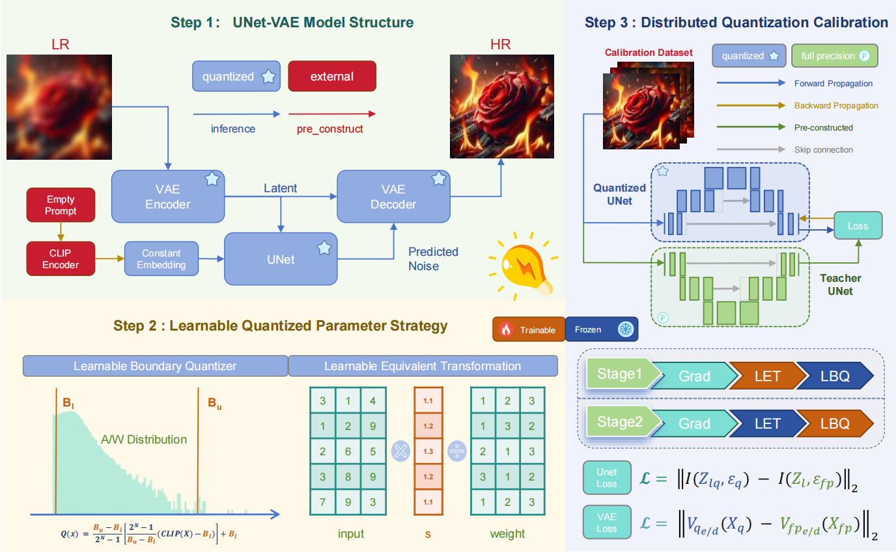
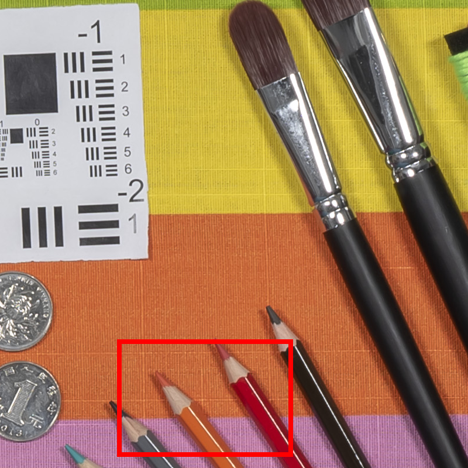
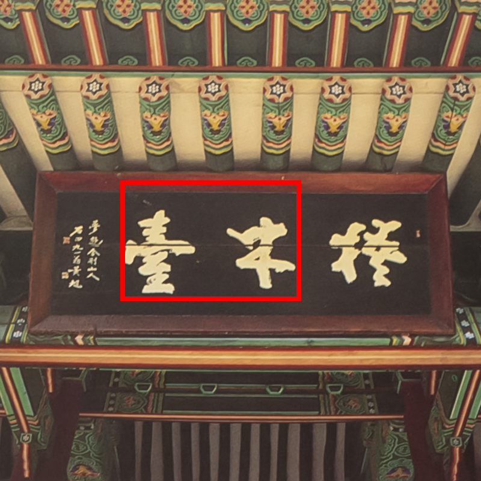
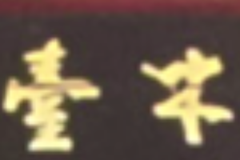
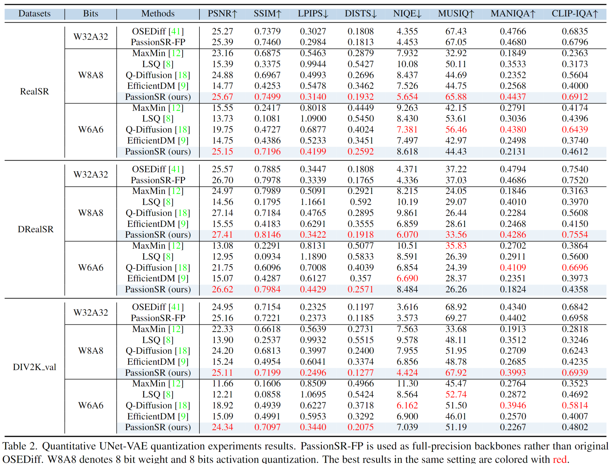

<div align="center">
  <p align="center">
    
  </p>
</div>

# 🚀 PassionSR: Low-Bit Quantized Super-Resolution

[LiBo Zhu](https://github.com/LiBoZhu030073), [Jianze Li](https://github.com/JianzeLi-114), [Haotong Qin](https://htqin.github.io/), [Wenbo Li](https://fenglinglwb.github.io/), [Yulun Zhang](http://yulunzhang.com/), [Yong Guo](https://www.guoyongcs.com/) and [Xiaokang Yang](https://scholar.google.com/citations?user=yDEavdMAAAAJ)  
**"PassionSR: Post-Training Quantization with Adaptive Scale in One-Step Diffusion based Image Super-Resolution", CVPR 2025**

[](https://github.com/libozhu03/PassionSR)
[](https://arxiv.org/abs/2411.17106)
[](https://github.com/libozhu03/PassionSR/releases/download/v.0.0.1/supp.pdf)
[](https://github.com/libozhu03/PassionSR/releases)
[](https://github.com/libozhu03/PassionSR)
[](https://github.com/libozhu03/PassionSR)

---

## 📚 Table of Contents

- [🔥 News](#-news)
- [📘 Abstract](#-abstract)
- [📝 Structure Overview](#-structure-overview)
- [🔎 Results](#-results)
- [⚙️ Installation](#️-installation)
- [📦 Download Pretrained Models](#-download-pretrained-models)
- [🏋️ Training](#-training)
- [🧪 Inference](#-inference)
- [📦 Measure](#-measure)
- [📌 Citation](#-citation)

---

## 🔥 News

- 🗓 **2024-11-25:** Repository released.
- 🏆 **2025-02-27:** PassionSR accepted to CVPR 2025 🎉

---

## 📘 Abstract

> Diffusion-based image super-resolution (SR) models have shown superior performance at the cost of multiple denoising steps. However, even though the denoising step has been reduced to one, they require high computational costs and storage requirements, making it difficult for deployment on hardware devices. To address these issues, we propose a novel post-training quantization approach with adaptive scale in one-step diffusion (OSD) image SR, PassionSR. First, we simplify OSD model to two core components, UNet and Variational Autoencoder (VAE) by removing the CLIPEncoder. Secondly, we propose Learnable Boundary Quantizer (LBQ) and Learnable Equivalent Transformation (LET) to optimize the quantization process and manipulate activation distributions for better quantization. Finally, we design a Distributed Quantization Calibration (DQC) strategy that stabilizes the training of quantized parameters for rapid convergence. Comprehensive experiments demonstrate that PassionSR with 8-bit and 6-bit obtains comparable visual results with full-precision model. Moreover, our PassionSR achieves significant advantages over recent leading low-bit quantization methods for image SR.

---

## 📝 Structure Overview


<p align="center">
  
</p>

|                      HR                      |                   LR                     |             OSEDiff(32-bit)             | EfficientDM(8-bit)  |             PassionSR(8-bit)             |
| :------------------------------------------: | :------------------------------------------: | :---------------------------------------------: | :---------------------------------------------: | :---------------------------------------------: |
|  |  |  |  |  |
|   |   |   | |   |


</details>

---

## <a name="-results"></a> 🔎 Results
PassionSR significantly out-performs previous methods at the setting of W8A8 and W6A6. 

Detailed results can be downloaded at [OneDrive](https://sjtueducn-my.sharepoint.com/:f:/g/personal/2814436848-zlb_sjtu_edu_cn/EhotaDEaaAxKh32w0sK5tb8Bw2gtcO57YJn6DqPRvwWQwQ?e=q1Lf8e).

<details>
<summary> 📊 Quantitative comparisons in Table 2 of the main paper (click to expand)</summary>

<p align="center">
  
</p>
</details>

<details>
<summary> 🖼 Visual comparison in Figure 6 of the main paper (click to expand)
</summary>

<p align="center">
  
</p>
</details>

---

## ⚙️ Installation
To set up the environment, clone the repository and create a new Conda environment using the provided dependencies.

```bash
git clone https://github.com/libozhu03/PassionSR.git
cd PassionSR
conda create -n passionsr python=3.10
conda activate passionsr
conda install pytorch==2.2.2 torchvision==0.17.2 torchaudio==2.2.2 pytorch-cuda=12.1 -c pytorch -c nvidia
pip install -r requirements.txt
```

Tested with:

* Python 3.10
* PyTorch 2.2.2
* CUDA 12.1


---

## 📦 Download Pretrained Models
We provide pretrained weights for PassionSR under different settings.

| Model     | Information     | Link                                |
| --------- | --------------- | ----------------------------------- |
| PassionSR | The calibrated model weights under different settings     |  [OneDrive](https://sjtueducn-my.sharepoint.com/:f:/g/personal/2814436848-zlb_sjtu_edu_cn/Es0NSYgpZUtIoc9KWf5Dp2IBvUbZVUPOgRLTGfRQ1hIKNw?e=NzQcti) |
| SD2.1     | Official model weights of stable diffusion 2.1  | [Huggingface](https://huggingface.co/stabilityai/stable-diffusion-2-1-base) |

Place them in `./weights/`.

---

## 🏋️ Training
Run the command below to perform Post-Training Quantization (PTQ) using your desired configuration file.
The script loads pretrained Stable Diffusion and OSEDiff weights, and applies quantization to selected components (e.g., UNet and/or VAE).

```bash
CUDA_VISIBLE_DEVICES="0" python ptq_quantize_single.py --config_file config_path
```

### 🔧 Configuration Example:
The example YAML config demonstrates typical usage and can be adapted for different settings.

```yaml
# device setting
device: "cuda:0"

cali_img_path: "data/cali_dataset" # path of calibration dataset

basic_config: # basic config for OSEDiff inference process
  seed: 42
  precision: "autocast"  # "full", "autocast"
  upscale: 4
  process_size: 512
  scale: 9.0
  lora_weights_path: preset/models/osediff.ckpt # OSEDiff ckpt path
  pretrained_model_name_or_path: hf-models/sd21 # stable diffusion path
  config: hf-models/ldm_Config/stable-diffusion/intel/v2-inference-v-fp32.yaml
  ckpt: hf-models/sd21/v2-1_512-ema-pruned.ckpt # stable diffusion ckpt path
  context_embedding_path: preset/models/empty_context_embedding.pt # empty text embedding path
  align_method: "nofix"  # 'wavelet', 'adain', 'nofix'
  merge_lora: True # merge lora into weight

quantize_config:
  quantize: True # quantize or not
  only_Unet: True # only quantize Unet or quantize both Unet and Vae
  Unet: # quantize setting for U-net
    quantype: PTQ # don't change
    method: saw_sep # name of method
    only_weight: False # weight only quantization method
    weight_quant_bits: 8
    weight_sym: False # weight quantization asymmetrical or not
    weight_sign: False # weight quantiztion sign or not
    act_quant_bits: 8
    act_sign: False # act quantiztion sign or not
    act_sym: False # act quantization asymmetrical or not
    split: True # half split for activation
    layer_type: 2Dquant # two quantizer types (2Dquant and normal_quant)
    s_alpha: 0.3 # scale factor intialization exponents
  Vae:
    quantype: PTQ
    method: saw
    only_weight: False
    weight_quant_bits: 8
    weight_sym: False
    weight_sign: False
    act_quant_bits: 8
    act_sign: False
    act_sym: False
    split: True
    layer_type: 2Dquant
  output_modelpath: results/quantize/saw_sep/UV/W8A8 # output path
  # calibration settings
  cali_batch_size: 4
  cali_learning_rate: 1e-5
  cali_epochs: 2
  loss_function: mse
  scheduler:
    milestones: [1]
    gamma: 0.1
  save_interval: 2

```

---

## 🧪 Inference
Use the following command to run inference with quantized models.
The pipeline supports various datasets (e.g., DIV2K_val, RealSR, DRealSR) and includes options for tiling, LoRA merging.

```bash
CUDA_VISIBLE_DEVICES="0" python inference_single.py --config config_path
```

### 🔧 Configuration Example:
```yaml
# device setting
device: cuda:0
out_dir: results/quantize/saw_sep/U/W8A8 # output path

# dataset to inference, set detailed dataset path in preset/data_construct.py
dataset: DIV2K_val # ["DIV2K_val", "RealSR", "DRealSR"] 

basic_config:
  seed: 42
  precision: "autocast" # ["full", "autocast"]
  process_size: 512
  config: hf-models/ldm_Config/stable-diffusion/intel/v2-inference-v-fp32.yaml
  ckpt: hf-models/sd21/v2-1_512-ema-pruned.ckpt
  lora_weights_path: preset/models/osediff.ckpt
  pretrained_model_name_or_path: hf-models/sd21
  context_embedding_path: preset/models/empty_context_embedding.pt
  upscale: 4
  align_method: adain # ['wavelet', 'adain', 'nofix']
  merge_lora: True

# scale: 9.0

# tile setting
tile_config:
  vae_decoder_tiled_size: 224 
  vae_encoder_tiled_size: 1024
  latent_tiled_size: 64 
  latent_tiled_overlap: 32

# quantize config
quantize_config:
  quantize: True
  only_Unet: True
  Unet: # keep same with quantize config
    quant_ckpt: weights/U_W8A8/PTQ/unet_ckpt_merge_saw_sep.pth # Unet quantize ckpt path
    quantype: PTQ
    method: saw
    only_weight: False
    weight_quant_bits: 8
    weight_sym: False
    weight_sign: False
    act_quant_bits: 8
    act_sign: False
    act_sym: False
    split: True
    layer_type: 2Dquant
    s_alpha: 0.3

```

## 📦 Measure

```bash
CUDA_VISIBLE_DEVICES="0" python measure.py -i YOUR_IMAGE_PATH -r HR_IMAGE_PATH
```


---

## 📌 Citation

```bibtex
@inproceedings{zhu2025passionsr,
  title={PassionSR: Post-Training Quantization with Adaptive Scale in One-Step Diffusion based Image Super-Resolution},
  author={Zhu, Libo and Li, Jianze and Qin, Haotong and Zhang, Yulun and Guo, Yong and Yang, Xiaokang},
  booktitle={CVPR},
  year={2025}
}
```

