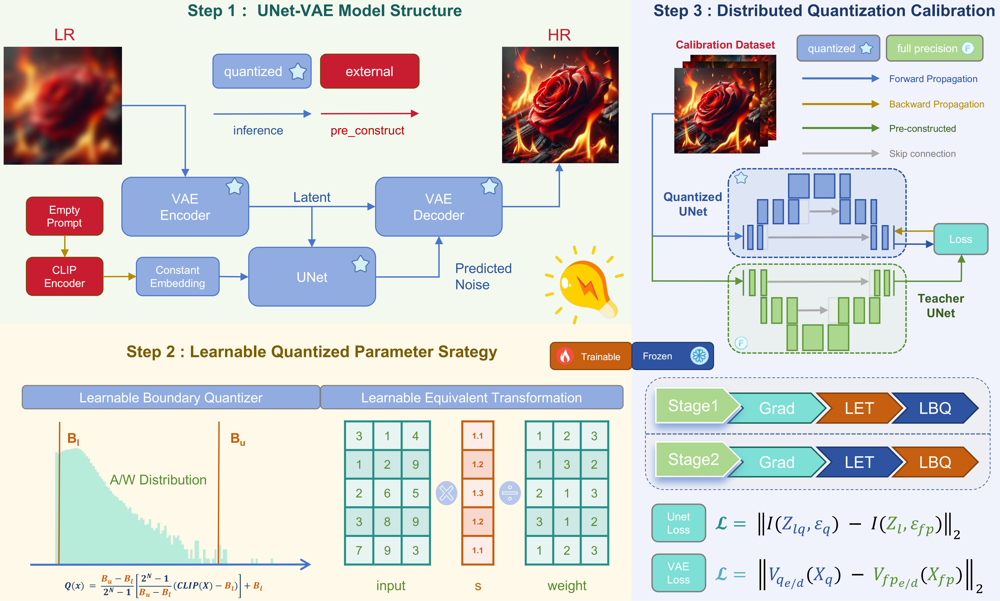
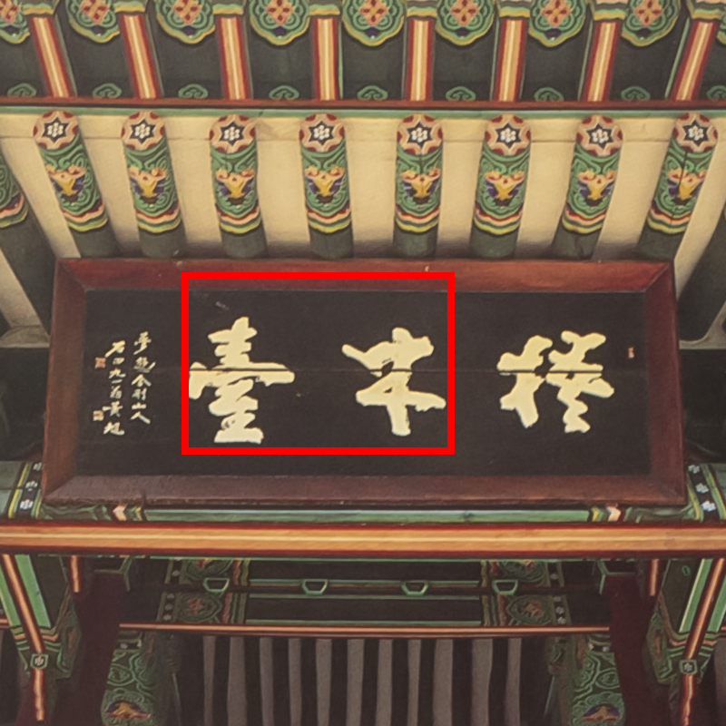
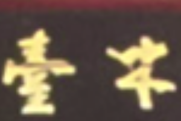

<div align="center">
<p align="center">  </p>
</div>

# PassionSR

[LiBo Zhu](https://github.com/LiBoZhu030073), [Jianze Li](https://github.com/JianzeLi-114), [Haotong Qin](https://htqin.github.io/), [Yulun Zhang](http://yulunzhang.com/), [Yong Guo](https://www.guoyongcs.com/) and [Xiaokang Yang](https://scholar.google.com/citations?user=yDEavdMAAAAJ), "Post-Training Quantization  with Adaptive Scale in One-Step Diffusion based Image Super-Resolution", arXiv, 2024

[arXiv] [supplementary material] [visual results]

#### 🔥🔥🔥 News

- **2024-11-25:** This repo is released.

> **Abstract:** Diffusion-based image super-resolution (SR) models have shown superior performance at the cost of multiple denoising steps. However, even though the denoising step has been reduced to one, they require high computational costs and storage requirements, making it difficult for deployment on hardware devices. To address these issues, we propose a novel post-training quantization approach with adaptive scale in one-step diffusion (OSD) image SR, PassionSR. First, we simplify OSD model to two core components, UNet and Variational Autoencoder (VAE) by removing the CLIPEncoder. Secondly, we propose Learnable Boundary Quantizer (LBQ) and Learnable Equivalent Transformation (LET) to optimize the quantization process and manipulate activation distributions for better quantization. Finally, we design a Distributed Quantization Calibration (DQC) strategy that stabilizes the training of quantized parameters for rapid convergence. Comprehensive experiments demonstrate that PassionSR with 8-bit and 6-bit obtains comparable visual results with full-precision model. Moreover, our PassionSR achieves significant advantages over recent leading low-bit quantization methods for image SR.



<!-- ---

[](https://imgsli.com/MjIyMjk5) [](https://imgsli.com/MjIyMzAy) [](https://imgsli.com/MjIyMzEw) [](https://imgsli.com/MjIyMzA4)

[](https://imgsli.com/MjIyMzA0) [](https://imgsli.com/MjIyMzAw) [](https://imgsli.com/MjIyMjk3) -->

---

|                      HR                      |                   LR                     |             OSEDiff(32-bit)             | EfficientDM(8-bit)  |             PassionSR(8-bit)             |
| :------------------------------------------: | :------------------------------------------: | :---------------------------------------------: | :---------------------------------------------: | :---------------------------------------------: |
|  |  |  |  |  |
|   |   |   | |   |

## ⚒️ TODO

* [ ] Release code and pretrained models

## 🔗 Contents

1. Datasets
1. Calibration
1. [Results](#results)
1. [Citation](#citation)

## <a name="results"></a>🔎 Results

PassionSR significantly out-performs previous methods at the setting of W8A8 and W6A6.

<details>
<summary>Evaluation on Synthetic Datasets (click to expand)</summary>


- quantitative comparisons in Table 2 of the main paper

<p align="center">
  
</p>


- visual comparison in Figure 6 of the main paper

<p align="center">
  
</p>
</details>


## <a name="citation"></a>📎 Citation

If you find the code helpful in your resarch or work, please cite the following paper(s).

```
@article{zhu2024passionsr,
  title={PassionSR: Post-Training Quantization  with Adaptive Scale in One-Step Diffusion based Image Super-Resolution},
  author={Libo Zhu, Jianze Li and Haotong Qin, Yulun Zhang and Yong Guo, Xiaokang Yang},
  journal={arXiv preprint arXiv:2303.06373},
  year={2024}
}
```
